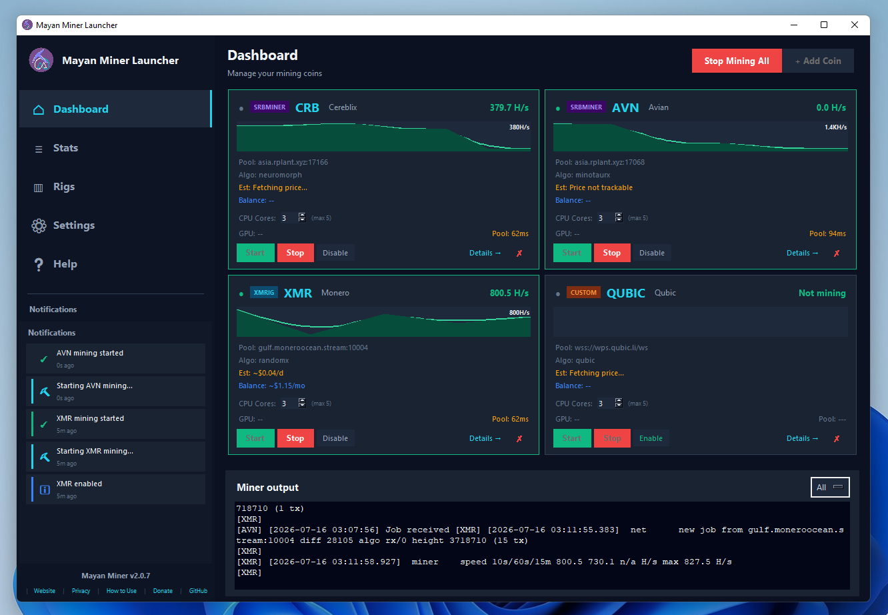

# Mayan Miner v2.0.0

Open-source Windows-first CPU/GPU mining launcher with a polished desktop dashboard, multi-coin mining, multi-miner support, live monitoring, automation features, and built-in miner installers.

Open-source Windows-first CPU/GPU mining launcher with a polished desktop dashboard, live monitoring, automation features, and built-in XMRig installer.


## Features

### Multi-Coin Dashboard
- **2×2 grid** — mine up to 4 coins simultaneously, each with its own miner process
- **Start/Stop Mining All** — single button to start all enabled coins or stop all running coins (with confirmation)
- **Per-coin CPU core allocation** — Spinbox on each card (0 = auto, max = total cores minus 10% reserve)
- **Miner kind badge** on each card — XMRig (cyan), SRBMiner (purple), Custom (orange)
- **Live hashrate chart** and earnings estimate per coin
- **Stats display adapts per coin** — shares/rejected for RandomX-family coins (XMR, SAL, ZEPH, etc.), blocks found for PoW coins (RVN, ETC, KAS, etc.)

### Multi-Miner Support
- **XMRig** — primary CPU miner for RandomX and CryptoNight algorithms
- **SRBMiner-Multi** — GPU + CPU miner supporting kawpow, etchash, autolykos2, and 50+ algorithms
- **Custom miners** — add up to 4 custom miner executables with command templates
- **Coin search with custom coin creation** — add any coin not in the database

### Settings & Configuration
- **6 tabs**: Pools, Hardware, Miner Tools, General, Automation, Profiles
- **Pools tab** — multi-coin pool management with per-coin pool lists, TLS and proxy support
- **Miner Tools tab** — 2-column layout (XMRig left, SRBMiner right), separate Install/Update buttons, custom miner grid
- **General tab** — splash, tray, theme, login settings (dev fee displayed but not editable)
- **Automation** — auto-restart on crash, scheduled mining, persistent log
- **Profiles** — save/load/delete named profiles, config export/import

### Monitoring & Notifications
- **CoinGecko price tracking** for all coins — "not listed yet" for unlisted coins
- **Fixed notification area** in sidebar — last 5-8 notifications with animations
- **Stats page** — per-coin checkboxes to filter charts, per-coin stats display
- **Miner output console** — filter by coin or show all

### Additional Features
- **Dark/Light theme** toggle — applies immediately, no restart
- **Desktop shortcut** created on first launch
- **Toggle to tray** on minimize/close (optional)
- **Start with Windows** and begin mining automatically (optional)
- **Encrypted local configuration** storage in `%APPDATA%\MayanMiner`
- **App update check** — checks GitHub releases, disables button if no update available
- **Transparent 0.2% developer fee** (not editable)

## Default developer wallet
- XMR: `DEV_WALLET`
- Fee: 0.2%

## Quick start
```powershell
python -m pip install -r requirements.txt
python main.py
```

Preview the generated launch command without opening the GUI:
```powershell
python main.py --headless
```

## Build Windows executable
```powershell
.\build_exe.ps1
```

The executable will be written to the `output` folder as `MayanMiner.exe`.

## Build the Windows installer
After building the executable, use Inno Setup and the installer script:
```powershell
cd installer
.\build_installer.ps1
```

The installer output will also be saved in the `output` folder.

## Installation and uninstall
1. Run `output\MayanMinerSetup.exe`.
2. Follow the standard Windows installation wizard.
3. The installer installs into `Program Files\Mayan Miner` by default and creates a Start menu shortcut (and optionally a desktop shortcut).
4. All app data (encrypted settings, encryption key, downloaded miner binaries) lives in `%APPDATA%\MayanMiner` — separate from program files.
5. Uninstall using Windows Settings > Apps > Mayan Miner, or the uninstall shortcut in the Start menu.

## Repository layout
- `main.py` — app launcher entry point
- `mayan_miner/` — application package
  - `app.py` — Tk UI shell (sidebar navigation, page routing)
  - `dashboard.py` — multi-coin dashboard with 2×2 grid
  - `stats_page.py` — stats page with per-coin chart filtering
  - `widgets.py` — CoinCard, StatCard, MiniChart, RealtimeChart, AnimatedProgressBar, ShareFeed
  - `stats.py` — parses live miner stdout into hashrate/shares/blocks history
  - `coins_db.py` — 26-coin database with pools, algorithms, and stats type classification
  - `coin_search.py` — search widget with custom coin creation
  - `price_tracker.py` — CoinGecko price tracking
  - `notifications.py` — notification center with animated widget
  - `splash.py` — startup splash screen
  - `tray.py` — system tray integration
  - `autostart.py` — Windows "start on login" registry helper
  - `config.py` — encrypted configuration management
  - `miner.py` — launch-command building for XMRig/SRBMiner/custom
  - `updater.py` — miner download and update management
  - Settings tabs: `pools_tab.py`, `hardware_tab.py`, `miner_tools_tab.py`, `general_tab.py`, `automation_tab.py`, `profiles_tab.py`, `settings_page.py`
- `installer/` — installer script and build workflow
- `output/` — packaged build artifacts (ignored by git)
- `tests/` — unit tests
- `assets/` — icons and images
- `version_info.txt` — EXE metadata (FileVersion, ProductVersion, CompanyName, etc.)

## Supported Coins

### CPU Mining (Shares-based)
| Coin | Algorithm | Miner |
|------|-----------|-------|
| XMR (Monero) | RandomX | XMRig |
| SAL (Salvium) | RandomX | XMRig |
| ZEPH (Zephyr) | RandomX | XMRig |
| QRL | RandomX | XMRig |
| XTM (Tari) | RandomX | XMRig |
| SATASHI | RandomX | XMRig |
| CCX (Conceal) | CryptoNight R | XMRig |
| RTM (Raptoreum) | GhostRider | SRBMiner |
| EPIC (EPIC Cash) | RandomARQ | XMRig |
| CRB (Cereblix) | NeuroMorph | XMRig |

### GPU Mining (Blocks-based)
| Coin | Algorithm | Miner |
|------|-----------|-------|
| ZANO (Zano) | ProgPow Zano | SRBMiner |
| RVN (Ravencoin) | KawPow | SRBMiner |
| ETC (Ethereum Classic) | Etchash | SRBMiner |
| KAS (Kaspa) | KHeavyHash | SRBMiner |
| ERG (Ergo) | Autolykos2 | SRBMiner |
| ALPH (Alephium) | Blake3 Alephium | SRBMiner |
| FIRO (Firo) | FiroPow | SRBMiner |
| XNA (Neurai) | KawPow | SRBMiner |
| KLS (Karlsen) | KarlsenHash v2 | SRBMiner |
| FLUX (Flux) | ZelHash | SRBMiner |
| ETHW (EthereumPoW) | KawPow | SRBMiner |
| QUAI (Quai Network) | ProgPow Quai | SRBMiner |
| RXD (Radiant) | SHA512/256d Radiant | SRBMiner |
| PYI (Pyrin) | PyrinHash | SRBMiner |
| NEOX (Neoxa) | KawPow | SRBMiner |
| XLS (Xelis) | XelisHash | SRBMiner |

## Repository
https://github.com/bugsfreeweb/MayanMiner

## License
MIT
